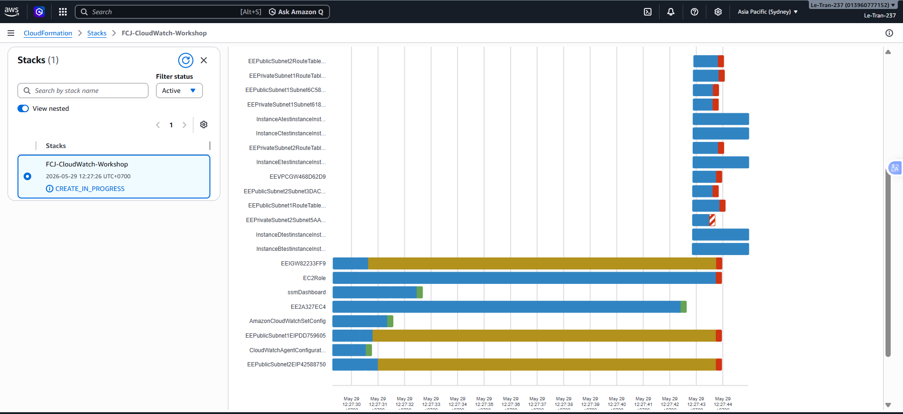

### Mục tiêu Tuần 4:

- Tạo ngân sách (Budget).
- Tìm hiểu các dịch vụ AWS cơ bản, cách sử dụng AWS Console và AWS CLI.

### Các công việc thực hiện trong tuần:

| Ngày | Công việc                                                                                                                                                                                                                                                                                                              | Ngày bắt đầu | Ngày hoàn thành | Trạng thái |
| ---- | ---------------------------------------------------------------------------------------------------------------------------------------------------------------------------------------------------------------------------------------------------------------------------------------------------------------------- | ------------ | --------------- | ---------- |
| 2    | - Tạo Budget   - Tạo Cost Budget   - Tạo Usage Budget                                                                                                                                                                                                                                                            | 11/05/2026   | 11/05/2026      | Hoàn thành |
| 3    | - Tạo RI Budget   - Tạo Savings Plans Budget                                                                                                                                                                                                                                                                        | 12/05/2026   | 12/05/2026      | Hoàn thành |
| 4    | - Đọc phần giới thiệu   - Thực hiện các bước chuẩn bị                                                                                                                                                                                                                                                               | 12/05/2026   | 12/05/2026      | Hoàn thành |
| 5    | - Tìm hiểu cơ bản về CloudWatch Metrics:  &emsp; + Xem Metrics  &emsp; + Search Expressions  &emsp; + Mathematical Expressions  &emsp; + Dynamic Labels   - Tìm hiểu cơ bản về CloudWatch Logs  &emsp; + CloudWatch Logs  &emsp; + CloudWatch Logs Insights  &emsp; + CloudWatch Metric Filter | 13/05/2026   | 13/05/2026      | Hoàn thành |
| 6    | - CloudWatch Alarms   - CloudWatch Dashboards                                                                                                                                                                                                                                                                       | 14/05/2026   | 14/05/2026      | Hoàn thành |

### Kết quả đạt được trong Tuần 4:

## Bước 1: Tạo Budget

- Tìm và mở dịch vụ **AWS Billing and Cost Management**.
- Chọn **Budgets** → **Create budget**.

## Bước 2: Tạo Cost Budget

- Mở dịch vụ **AWS Billing and Cost Management**.
- Chọn **Budgets** → **Create budget**.
- Trong phần **Budget setup**:
  - Chọn **Customize**.
  - Trong **Budget types**, chọn **Cost budget**.

## Bước 3: Tạo RI Budget

- Thực hiện tương tự bước 2.
- Trong **Budget setup**:
  - Chọn **Customize**.
  - Chọn **Reservation budget**.

## Bước 4: Tạo Savings Plans Budget

- Thực hiện tương tự bước 2.
- Trong **Budget setup**:
  - Chọn **Customize**.
  - Trong **Budget types**, chọn **Savings Plans budget**.

## Bước 5: CloudWatch Metrics + CloudWatch Logs + CloudWatch Alarms + CloudWatch Dashboards

## 1. CloudWatch Metrics

### Các bước thực hiện

- Tìm kiếm và mở dịch vụ CloudWatch.
- Trong thanh điều hướng bên trái, chọn **Metrics > All metrics**.
- Tìm kiếm các chỉ số của EC2.
- Mở **EC2 > Per-Instance Metrics**.
- Lọc chỉ số **CPUUtilization**.
- Chọn hai phiên bản EC2 để so sánh hiệu suất CPU.
- Quan sát hoạt động tải công việc trên biểu đồ.
- Tìm kiếm **EBSWriteBytes** để phân tích hoạt động ghi dữ liệu của ổ đĩa.

### Kết quả

Đã quan sát và so sánh được hiệu suất CPU giữa các EC2 instance, đồng thời theo dõi hoạt động lưu trữ thông qua chỉ số EBSWriteBytes.

---

## 2. Search Expressions

### Các bước thực hiện

1. Xóa biểu đồ cũ.
2. Quay lại tab **Browse**.
3. Thêm chỉ số **CPUUtilization**.
4. Chọn **Graph search**.
5. Thêm các biểu thức tìm kiếm như:
   - SEARCH("disk_used_percent", 'Average', 300)
   - SEARCH("used", 'Average', 300)

6. Chuyển kiểu biểu đồ sang **Stacked area**.

### Kết quả

Search Expressions giúp tìm kiếm các chỉ số nhanh hơn và cải thiện khả năng theo dõi nhiều metrics trên cùng một biểu đồ.

---

## 3. Mathematical Expressions

### Các bước thực hiện

1. Xóa các biểu thức trước đó.
2. Quay lại tab **Browse**.
3. Chọn **Add math**.
4. Chọn **Top 10 by sum**.
5. Áp dụng biểu thức:

   SORT(e1, SUM, DEC, 3)

### Kết quả

Biểu đồ tự động sắp xếp các metrics theo tổng giá trị, giúp dễ dàng xác định những tài nguyên có mức hoạt động cao nhất.

---

## 4. Dynamic Labels

### Các bước thực hiện

1. Xóa các bộ lọc và biểu thức trước đó.
2. Mở namespace **CWAgent**.
3. Chọn các dimensions:
   - ImageId
   - InstanceId
   - InstanceType
   - exe
   - process_name

4. Lọc theo:
   - exe=cloudwatch
   - MetricName=procstat_memory_rss

5. Chọn **Graph search**.
6. Thêm Dynamic Labels bằng:

   ${PROP('Dim.exe')} - ${PROP('Dim.InstanceId')} - ${PROP('MetricName')}

### Kết quả

Dynamic Labels tự động cập nhật tên hiển thị của biểu đồ, giúp dễ dàng nhận biết các metrics.

---

## 5. CloudWatch Logs

### Các bước thực hiện

1. Mở giao diện CloudWatch.
2. Chọn **Logs > Log groups**.
3. Tìm kiếm **/ec2/linux/var/log/messages**.
4. Mở một Log Stream của EC2.
5. Xem các bản ghi hệ thống.
6. Thiết lập thời gian lưu trữ log là **1 tuần**.

### Kết quả

CloudWatch Logs lưu trữ và quản lý các log hệ thống của EC2, hỗ trợ việc giám sát và xử lý sự cố.

---

## 6. CloudWatch Logs Insights

### Các bước thực hiện

1. Mở EC2 Console.
2. Kết nối tới EC2 bằng **Session Manager**.
3. Tải xuống và chạy tập lệnh **logger.py**.
4. Theo dõi log bằng lệnh:

   sudo tail -f /var/log/messages

5. Mở **CloudWatch Logs Insights**.
6. Thực hiện các truy vấn như:
   - ERROR logs
   - WARN logs
   - eth0 logs

7. Trực quan hóa kết quả truy vấn.
8. Lưu các truy vấn để sử dụng sau.

### Kết quả

CloudWatch Logs Insights hỗ trợ tìm kiếm, lọc và trực quan hóa dữ liệu log, giúp giám sát ứng dụng hiệu quả hơn.

---

## 7. CloudWatch Metric Filter

### Các bước thực hiện

1. Mở Log Group **/ec2/linux/var/log/messages**.
2. Chọn **Create metric filter**.
3. Sử dụng **ERROR** làm mẫu lọc.
4. Cấu hình:
   - Metric namespace: ec2-logs
   - Metric name: /var/log/messages - ERROR
   - Metric value: 1

5. Tạo Metric Filter.

### Kết quả

Metric Filter chuyển các sự kiện ERROR trong log thành CloudWatch Metrics để phục vụ việc giám sát.

---

## 8. CloudWatch Alarms

### Các bước thực hiện

1. Mở **CloudWatch Alarms**.
2. Chọn **Create alarm**.
3. Chọn chỉ số ERROR đã tạo.
4. Cấu hình:
   - Chu kỳ: 1 phút
   - Ngưỡng: Lớn hơn 10

5. Tạo SNS Topic để gửi thông báo qua email.
6. Đặt tên cảnh báo là **PythonApplicationErrorAlarm**.
7. Xác nhận đăng ký SNS qua email.

### Kết quả

CloudWatch Alarm giám sát số lượng lỗi của ứng dụng và tự động gửi thông báo khi vượt ngưỡng đã thiết lập.

---

## 9. CloudWatch Dashboard

### Các bước thực hiện

1. Chọn Alarm đã tạo.
2. Chọn **Add to dashboard**.
3. Tạo Dashboard với tên **CloudWatch-Workshop**.
4. Thêm các widget hiển thị Alarm vào Dashboard.

### Kết quả

Dashboard cung cấp giao diện tập trung để theo dõi các metrics và cảnh báo của hệ thống.

---

## Kết luận

Trong tuần này, tôi đã học cách sử dụng Amazon CloudWatch để giám sát các tài nguyên AWS, phân tích log, tạo cảnh báo và xây dựng Dashboard theo dõi hệ thống. Bài thực hành giúp tôi có thêm kinh nghiệm thực tế trong việc trực quan hóa dữ liệu, phân tích log và triển khai cơ chế giám sát tự động trên AWS.
